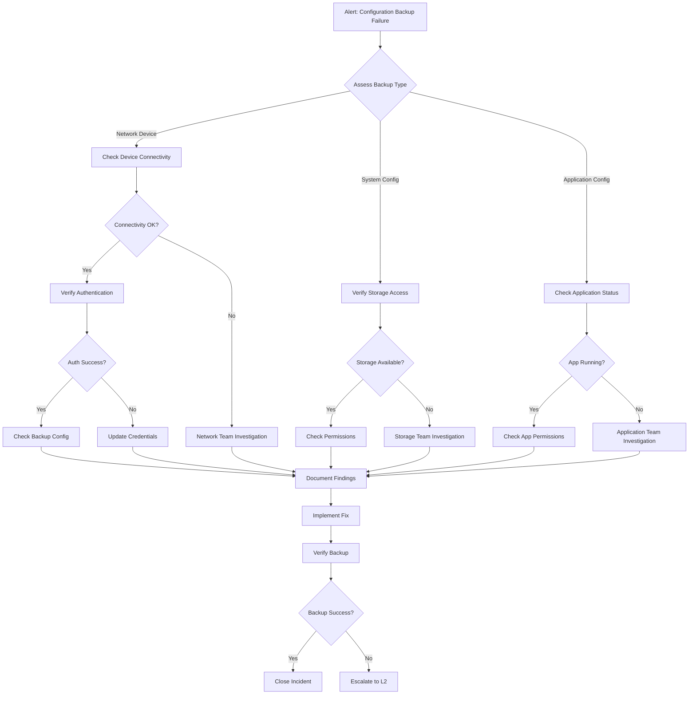

# Configuration Backup Failure - Security Analysis Report

## 1. Framework Analysis & Security Controls

### MITRE ATT&CK
- Maps to T1490 (Inhibit System Recovery)
- Potential adversary attempts to prevent system recovery
- Related to backup corruption and deletion tactics

### ISO 27001
- Control A.12.3 (Information Backup)
- Control A.12.1.2 (Change Management)
- Focus on backup integrity and change control procedures

### NIS 2
- Article 21 - Risk management measures
- Emphasis on backup management
- Disaster recovery requirements
- Incident reporting obligations

### DORA
- Article 11 - ICT Risk Management
- Focus on backup and recovery procedures
- Operational resilience requirements
- Incident classification and reporting

### PCI DSS
- Requirement 10.5 (Secure audit trails)
- Requirement 12.10 (Incident Response Plan)
- Backup retention and security requirements

### SOC2
- CC7.3 (System Operations)
- CC8.1 (Change Management)
- Focus on operational effectiveness and change control

## 2. Log Sources & Monitoring Points

### Backup Software Logs
1. Veeam Backup & Replication
   - Job session logs
   - Error logs
   - Configuration change logs

2. Commvault
   - Job history
   - Alert logs
   - System logs

3. Veritas NetBackup
   - Activity logs
   - Error logs
   - Policy change logs

4. Cloud Backup Solutions
   - Azure Backup logs
   - AWS Backup logs
   - Configuration change history

### Operating System Logs
1. Windows Event Logs
   - System logs
   - Application logs
   - Security logs
   - PowerShell logs

2. Linux System Logs
   - /var/log/syslog
   - /var/log/messages
   - /var/log/secure
   - Application-specific logs

### Network Device Logs
1. Cisco ASA
   - ASDM logs
   - Console logs
   - Configuration backup logs
   - System messages

2. Fortigate
   - System event logs
   - Configuration changes
   - Admin activity logs
   - Backup status logs

3. F5 BIG-IP
   - UCS backup logs
   - Configuration sync logs
   - System messages
   - Admin activity logs

## 3. Detection & Investigation Queries

### Microsoft Sentinel KQL Query
```sql
let timeframe = 24h;
union isfuzzy=true
    (SecurityEvent
    | where TimeGenerated > ago(timeframe)
    | where EventID in ("4656", "4657", "4660", "4663")
    | where ObjectName contains "backup" or TaskName contains "backup"
    ),
    (Event
    | where TimeGenerated > ago(timeframe)
    | where Source == "Backup"
    | where EventID in (100, 517, 519, 528)
    ),
    (Syslog
    | where TimeGenerated > ago(timeframe)
    | where Facility == "backup" or SyslogMessage contains "backup failure"
    )
| project TimeGenerated, Source, Computer, Event=EventID, Activity, CommandLine, AccountName
| sort by TimeGenerated desc
```

### Microsoft Defender Advanced Hunting Query
```sql
let timeframe = 24h;
DeviceEvents
| where Timestamp > ago(timeframe)
| where ActionType in ("BackupFailed", "ConfigurationModified")
| extend ParsedFields=parse_json(AdditionalFields)
| project Timestamp, DeviceName, ActionType, 
    BackupPath = ParsedFields.BackupPath,
    ErrorCode = ParsedFields.ErrorCode,
    InitiatingProcessAccountName
| join kind=leftouter (
    DeviceNetworkEvents
    | where Timestamp > ago(timeframe)
    | where RemotePort in (445, 137, 138, 139)
    | project DeviceName, ConnectionTime=Timestamp, RemoteIP, RemotePort
) on DeviceName
| sort by Timestamp desc
```

## 4. Incident Response Flowchart



## 5. IT Team Response Instructions

### Immediate Actions
1. Document the exact time and scope of the backup failure
2. Identify affected systems and configurations
3. Take screenshots or document error messages
4. Check backup logs for specific error codes

### Investigation Steps
1. Network Connectivity Verification
   - Test connectivity to backup destination
   - Check for any network changes or maintenance
   - Verify DNS resolution
   - Test bandwidth availability

2. Storage System Validation
   - Verify storage capacity
   - Check storage system health
   - Validate access permissions
   - Review storage logs for errors

3. Authentication Checks
   - Verify service account status
   - Check for expired credentials
   - Validate permissions on target systems
   - Review recent password changes

4. Configuration Analysis
   - Compare against last known good configuration
   - Check for recent changes
   - Validate backup schedules
   - Review retention policies

### Recovery Procedures
1. Backup System Recovery
   - Reset failed backup jobs
   - Clear temporary files if necessary
   - Restart backup services
   - Test with minimal configuration

2. Documentation Requirements
   - Record all changes made
   - Update incident ticket
   - Note any deviations from standard procedure
   - Document lessons learned

### Escalation Path
- L1 Support: Initial investigation (0-30 minutes)
- L2 Support: Deep technical investigation (30-60 minutes)
- L3 Support: Vendor engagement if needed (>60 minutes)
- Management: Status updates at 2-hour intervals

### Communication Protocol
1. Initial Notification
   - Affected teams
   - Service desk
   - System owners

2. Status Updates
   - Every 2 hours during business hours
   - Every 4 hours during non-business hours
   - Immediate updates for critical changes

3. Resolution Communication
   - Root cause identified
   - Actions taken
   - Prevention measures
   - Lessons learned

### Post-Incident Tasks
1. Update documentation
2. Review and adjust monitoring
3. Schedule preventive maintenance
4. Update runbooks if needed
5. Schedule team training if required

## 6. Additional Security Considerations

### Prevention Measures
1. Regular backup testing and validation
2. Configuration backup monitoring
3. Access control reviews
4. Credential rotation schedule
5. Storage capacity planning

### Compliance Requirements
1. Maintain detailed logs of all backup failures
2. Document incident response actions
3. Track mean time to recovery (MTTR)
4. Regular review of backup policies
5. Annual testing of recovery procedures

### Security Recommendations
1. Implement encryption for backup data
2. Use separate credentials for backup operations
3. Regular security assessments
4. Network segmentation for backup infrastructure
5. Multi-factor authentication for backup systems
