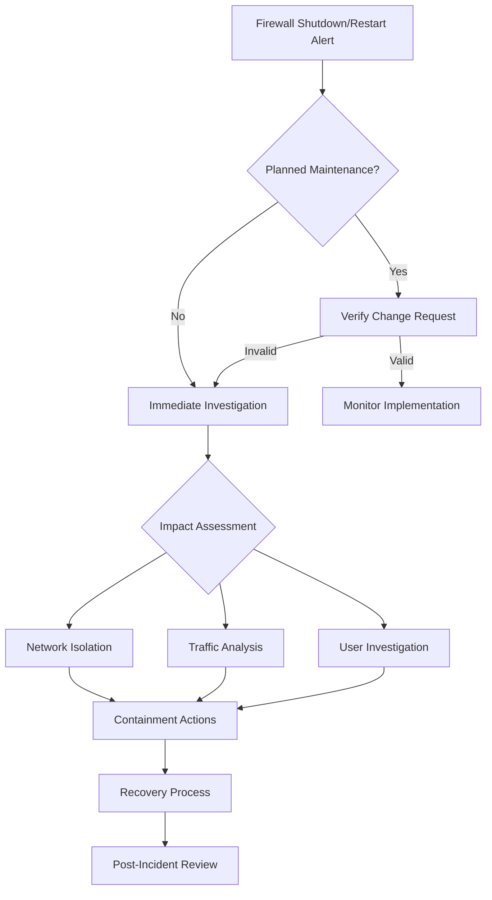

# Firewall Shutdown/Restart Security Analysis

## Threat Description & Framework Mapping

### MITRE ATT&CK
- **Technique**: T1489 - Service Stop
- **Tactic**: Impact
- **Sub-technique**: T1489.001 - Service Stop: Firewall

### Regulatory Framework Mapping
- **ISO 27001**: A.13.1.2 (Network Security), A.12.1.2 (Change Management)
- **NIS 2**: Article 21 - Risk Management Measures
- **DORA**: Article 6 - ICT Risk Management
- **PCI DSS**: Requirement 1 (Firewall Configuration), 10 (Audit Logging)
- **SOC 2**: CC7.1, CC7.2 (Change Management, Security Operations)

## Log Sources & Monitoring

### Network Devices
1. **Cisco ASA**
   - System logs (%ASA-1-101001, %ASA-1-411001)
   - ASDM logs
   - Console logs

2. **Fortigate**
   - Event: system-reboot
   - Event: system-shutdown
   - Log ID: 32001 (system events)

3. **F5 BIG-IP**
   - /var/log/ltm
   - /var/log/audit
   - MCPd logs

### KQL Queries

#### Microsoft Sentinel
```kql
// Monitor firewall shutdown/restart events
let timeframe = 1h;
SecurityEvent
| where TimeGenerated > ago(timeframe)
| where EventID in (538, 513, 1074)  // Shutdown/restart events
| extend Account = strcat(Domain, "\\", Account)
| where AccountType == "User"
| project TimeGenerated, Computer, Account, EventID, Activity
| union (
    CommonSecurityLog
    | where TimeGenerated > ago(timeframe)
    | where DeviceEventClassID in ("system-reboot", "system-shutdown", "%ASA-1-101001")
    | project TimeGenerated, Computer = DeviceName, Account = SourceUserName, 
             EventID = DeviceEventClassID, Activity = Activity
)
```

#### Microsoft Defender Advanced Hunting
```kql
// Monitor for unexpected firewall service termination
let timeframe = 1h;
DeviceEvents
| where Timestamp > ago(timeframe)
| where ActionType in ("ServiceStop", "ServiceConfigurationChange")
| where InitiatingProcessFileName in ("mpsvc.dll", "mpssvc.dll", "firewallapi.dll")
| project Timestamp, DeviceName, AccountName, ActionType, 
         InitiatingProcessFileName, InitiatingProcessCommandLine
```

## Incident Response Flowchart



## IT Team Instructions

### Immediate Actions
1. Verify if shutdown/restart was planned maintenance
2. Check change management system for approved changes
3. Identify source IP and user account responsible
4. Review logs for suspicious activities preceding the event

### Containment Steps
1. If unauthorized:
   - Immediately enable backup firewall if available
   - Implement emergency ACLs on core switches
   - Block suspicious source IPs
   
2. If authorized but problematic:
   - Roll back to last known good configuration
   - Verify rule base integrity
   - Check for configuration changes

### Recovery Process
1. Restore firewall services following secure baseline
2. Verify all rules and policies are properly applied
3. Conduct thorough testing of critical services
4. Monitor for any anomalies post-restoration

### Documentation Requirements
1. Record incident timeline
2. Document all changes made during recovery
3. Update incident report with root cause
4. Create lessons learned document
5. Update runbooks if necessary

### Communication Plan
1. Notify Security Operations Center
2. Update stakeholders on service status
3. Coordinate with Network team for traffic analysis
4. Engage vendor support if needed