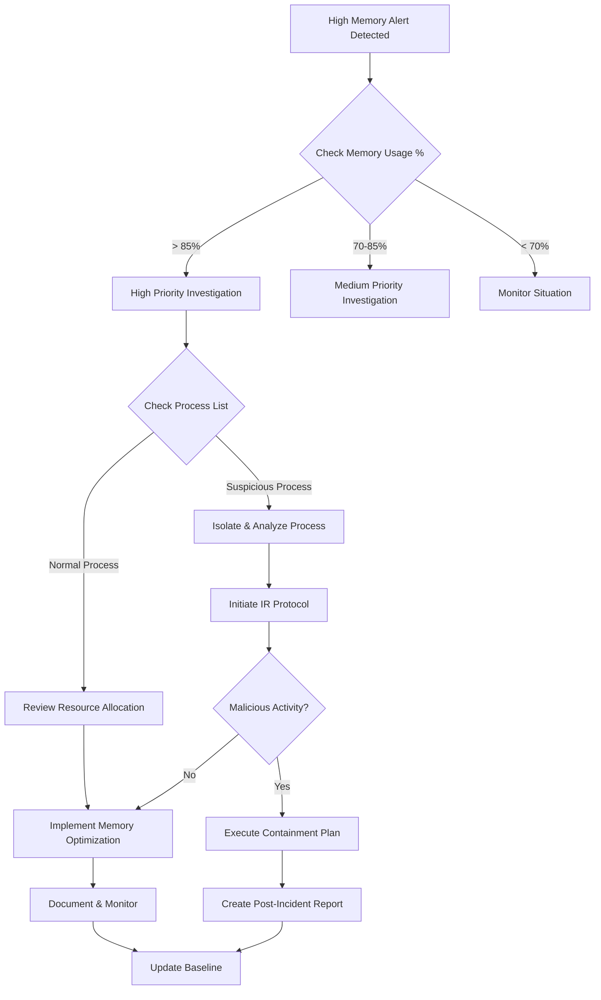

# Security Analysis - High Memory Usage in Firewall

## 1. Framework & Compliance Alignment

### MITRE ATT&CK
- **Technique**: T1499 (Endpoint Denial of Service)
- **Sub-technique**: T1499.004 (Application or System Exploitation)
- **Tactics**: Impact, Defense Evasion

### Compliance Requirements
- **ISO 27001**: 
  - A.12.1.3 (Capacity Management)
  - A.12.4 (Logging and Monitoring)
- **NIS 2**: 
  - Article 21 - Risk Analysis
  - Information System Security
- **DORA**: 
  - Incident Management
  - Business Continuity requirements
- **PCI DSS**: 
  - Requirement 10.6 (Review Logs)
  - Requirement 6.4 (Change Management)
- **SOC 2**: 
  - CC7.2 (Monitoring Security Events)

## 2. Log Sources & Monitoring

### Cisco ASA
- System logs (/var/log/messages)
- SNMP traps
- Show tech-support output
```
show memory
show processes memory
show memory profile
```

### Fortinet FortiGate
- Memory usage logs in FortiAnalyzer
- System Resources widget
- SNMP memory utilization metrics
```
get system performance status
diagnose sys top
```

### F5 BIG-IP
- /var/log/ltm
- SNMP monitoring data
- TMM memory statistics
```
tmctl -s memory
tmstat
```

## 3. Detection Queries

### Microsoft Sentinel KQL Query
```kql
// Query to detect high memory usage in firewalls
let threshold = 85; // Configurable threshold percentage
CommonSecurityLog
| where DeviceType in ("Cisco ASA", "Fortinet", "F5")
| where TimeGenerated > ago(1h)
| where AdditionalExtensions has "memory"
| extend MemoryUsage = extract("memoryUsage=([0-9]+)", 1, AdditionalExtensions)
| where MemoryUsage > threshold
| project TimeGenerated, DeviceType, DeviceName, MemoryUsage, SourceIP, AdditionalExtensions
| sort by TimeGenerated desc
```

### Microsoft Defender Advanced Hunting Query
```kql
// Advanced Hunting query for network device monitoring
DeviceEvents
| where TimeGenerated > ago(1h)
| where DeviceType in ("NetworkDevice")
| where AdditionalFields has "memory"
| extend MemoryMetrics = parse_json(AdditionalFields)
| extend MemoryUsage = todouble(MemoryMetrics.memoryUsagePercentage)
| where MemoryUsage > 85
| project
    TimeGenerated,
    DeviceName,
    MemoryUsage,
    IPAddress = DeviceIP,
    AdditionalFields
| sort by TimeGenerated desc
```

## 4. Incident Response Flowchart


## 5. IT Team Instructions

### Phase 1: Initial Assessment (0-30 minutes)
1. Execute KQL queries above to identify affected devices
2. Collect baseline memory statistics
3. Identify recent changes or updates
4. Document current memory usage patterns

### Phase 2: Immediate Actions (30-60 minutes)
1. Check running services and processes
2. Review connection table size
3. Verify VPN tunnel status
4. Check for memory leaks in logging processes
5. Take screenshots or export current configurations

### Phase 3: Investigation (1-2 hours)
1. Analyze traffic patterns for potential DDoS
2. Review security policy configuration
3. Check for rule optimization opportunities
4. Examine NAT table status
5. Review system logs for related events

### Phase 4: Mitigation Steps
1. Clear expired sessions
2. Optimize security policies
3. Adjust session timeouts if needed
4. Enable memory conservation mode if available
5. Document all changes made

### Phase 5: Recovery
1. Monitor memory usage for 24 hours post-mitigation
2. Update monitoring thresholds if needed
3. Document findings and actions taken
4. Update runbooks with new findings
5. Schedule follow-up review

### Phase 6: Prevention
1. Implement memory usage baselines
2. Configure automated alerts:
   - Warning threshold: 75%
   - Critical threshold: 85%
3. Schedule regular policy optimization reviews
4. Update capacity planning documentation
5. Review and update monitoring rules

## 6. Additional Recommendations

### Monitoring Enhancement
1. Implement SNMP monitoring for real-time memory tracking
2. Set up trend analysis for capacity planning
3. Configure correlation rules for related events

### Documentation Requirements
1. Incident timeline
2. Actions taken
3. Configuration changes
4. Performance impact
5. Root cause analysis
6. Recommendations for prevention

### Stakeholder Communication
1. Initial notification
2. Status updates every 30 minutes for critical issues
3. Post-incident report
4. Preventive measures implementation plan

Remember to adjust thresholds and response times based on your organization's specific requirements and service level agreements (SLAs).
