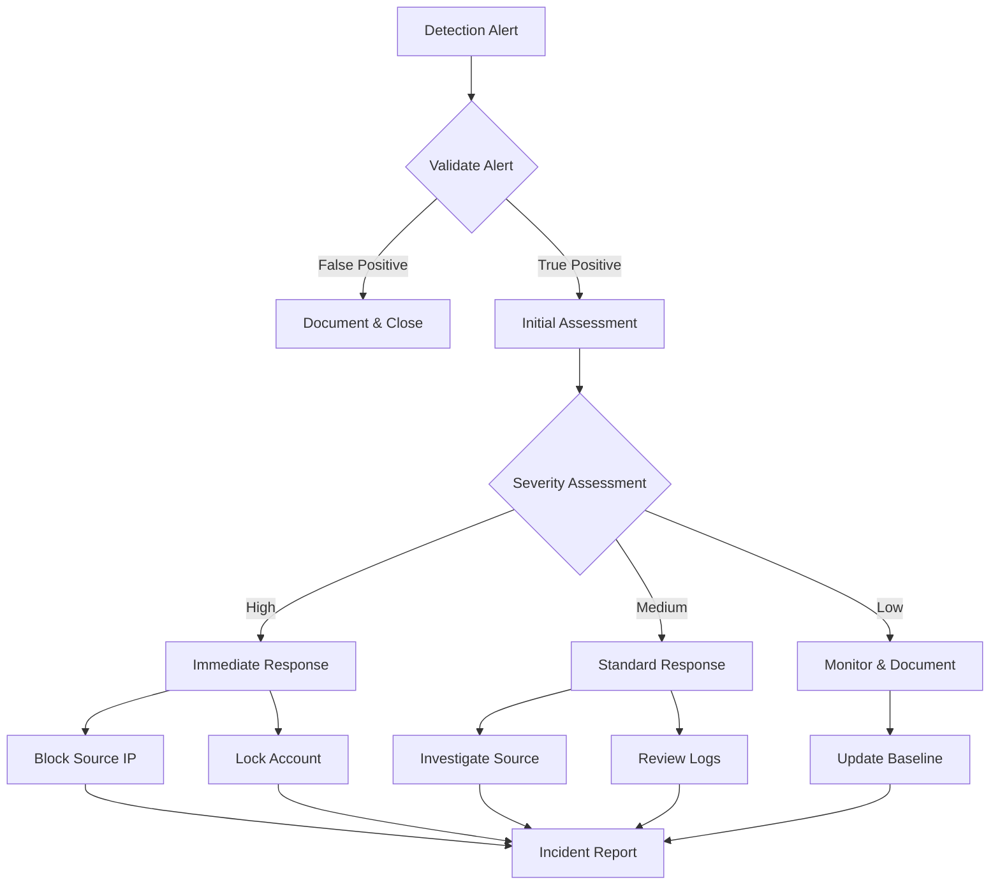

# Security Analysis: Excessive Failed Login Attempts to Network Device

## Threat Analysis & Framework Mapping

### MITRE ATT&CK References
- Initial Access [TA0001]
- Credential Access [TA0006]
- Brute Force [T1110]
- Valid Accounts [T1078]

### Regulatory Framework Alignment
1. ISO 27001
   - A.9.4.1 Information access restriction
   - A.9.4.2 Secure log-on procedures
   - A.12.4.1 Event logging

2. NIS 2
   - Article 21: Security measures for access control
   - Article 23: Logging and monitoring requirements

3. DORA
   - Article 16: ICT Risk Management
   - Article 29: Incident reporting obligations

4. PCI DSS v4.0
   - Requirement 7: Access Control
   - Requirement 10.2: Audit Logging
   - Requirement 8.3.1: Lock out user accounts

5. SOC 2
   - CC6.1: Logical Access Security
   - CC7.2: Incident Response
   - CC7.3: Anomaly Detection

## Log Sources & Configuration

### Cisco ASA
```
logging enable
logging trap informational
logging host inside [SIEM-IP]
logging facility local4
logging timestamp
logging permit-hostdown
```

### FortiGate
```
config log syslogd setting
    set status enable
    set server [SIEM-IP]
    set facility local4
    set source-ip [FORTIGATE-IP]
end
```

### F5 BIG-IP
```
sys syslog {
    remote-servers {
        remote_server {
            host [SIEM-IP]
            local-ip [F5-IP]
            remote-port 514
        }
    }
}
```

## Detection Queries

### Microsoft Sentinel KQL
```kql
let threshold = 5;
let timeframe = 5m;
CommonSecurityLog
| where DeviceVendor in ("Cisco", "Fortinet", "F5")
| where Activity contains "Login" 
    or Activity contains "Authentication"
| where OutcomeDesc contains "Failed" 
    or OutcomeDesc contains "Failure"
| summarize 
    FailedCount = count(),
    LastFailure = max(TimeGenerated),
    FirstFailure = min(TimeGenerated),
    SourceIPs = make_set(SourceIP),
    AccountsList = make_set(Account)
    by bin(TimeGenerated, timeframe), DestinationIP
| where FailedCount >= threshold
| extend TimeDelta = LastFailure - FirstFailure
| project 
    TimeGenerated,
    DestinationIP,
    FailedCount,
    TimeDelta,
    SourceIPs,
    AccountsList
```

### Microsoft Defender Advanced Hunting
```kql
let threshold = 5;
let timeframe = 5m;
DeviceNetworkEvents
| where RemotePort in (22, 23, 443, 80)
| where ActionType == "ConnectionFailed"
| where RemoteIP in (
    // Network device IP ranges
    "[NETWORK-DEVICE-RANGE]"
)
| summarize 
    FailedCount = count(),
    LastFailure = max(Timestamp),
    AttackingDevices = make_set(DeviceName)
    by bin(Timestamp, timeframe), 
    RemoteIP,
    InitiatingProcessAccountName
| where FailedCount >= threshold
```

## Incident Response Flowchart



## IT Team Instructions

### Immediate Actions (0-30 minutes)
1. VALIDATE the alert by checking:
   - Number of failed attempts
   - Source IP addresses
   - Targeted accounts
   - Time window of attempts

2. CONTAIN the threat:
   - Block source IP addresses at the firewall
   - Enable additional logging for affected devices
   - Lock affected accounts if suspicious activity confirmed

### Investigation Phase (30-120 minutes)
1. COLLECT evidence:
   - Authentication logs from all network devices
   - Network flow data
   - Related security events

2. ANALYZE attack pattern:
   - Geographic location of source IPs
   - Attack timing and frequency
   - Common usernames attempted
   - Attack tool signatures

### Remediation Steps
1. IMPLEMENT security hardening:
   - Enable multi-factor authentication
   - Review and update access control lists
   - Implement rate limiting for authentication attempts
   - Update password policies

2. DOCUMENT findings:
   - Attack timeline
   - Affected systems
   - Actions taken
   - Recommendations for prevention

### Prevention Measures
1. ENHANCE monitoring:
   - Adjust alert thresholds if needed
   - Implement additional logging
   - Configure automated responses

2. UPDATE procedures:
   - Review and update incident response playbook
   - Conduct team training on new measures
   - Schedule regular security assessments

## Additional Notes
- All actions must be documented in the ticketing system
- Updates to management required for high-severity incidents
- Post-incident review meeting required within 48 hours
- Update threat intelligence feeds with indicators
