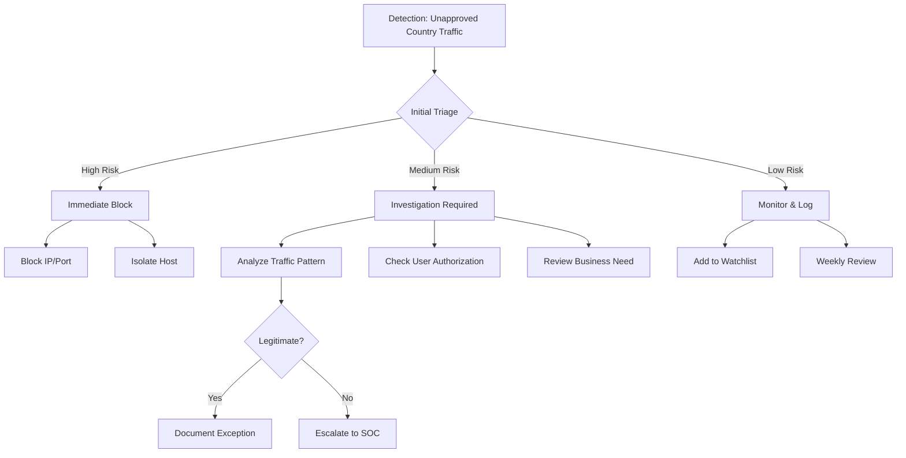

# KQL Query for Microsoft Sentinel

```kql
// Query for detecting outbound traffic to unapproved countries
CommonSecurityLog
| where TimeGenerated > ago(24h)
| where DeviceAction != "deny"
| where isnotempty(DestinationIP) 
| extend Country = geo_info_from_ip_address(DestinationIP).country
| where Country !in ("US", "CA", "GB") // Replace with your approved countries
| project
    TimeGenerated,
    SourceIP,
    SourceUserName,
    DestinationIP,
    Country,
    ApplicationProtocol,
    RequestURL,
    DeviceAction
| sort by TimeGenerated desc

# KQL Query for Microsoft Defender Advanced Hunting

```kql
// Query for detecting outbound connections from endpoints
DeviceNetworkEvents
| where Timestamp > ago(24h)
| where ActionType == "ConnectionSuccess"
| where RemoteIPType == "Public"
| extend Country = geo_info_from_ip_address(RemoteIP).country
| where Country !in ("US", "CA", "GB") // Replace with your approved countries
| project
    Timestamp,
    DeviceName,
    InitiatingProcessFileName,
    RemoteIP,
    RemotePort,
    Country,
    RemoteUrl
| sort by Timestamp desc
```

# Incident Response Flowchart



# Instructions for IT Team

## Immediate Actions
1. IDENTIFY affected systems and users
   - Pull system logs from EDR
   - Review firewall logs for connection history
   - Document all identified IPs and ports

2. CONTAIN the incident
   - Block outbound traffic to identified IPs
   - Apply firewall rules for country-based blocking
   - Enable enhanced logging for affected systems

3. INVESTIGATE
   - Review business justification for connections
   - Check for data exfiltration indicators
   - Analyze process trees and network connections

4. REMEDIATE
   - Update firewall policies
   - Implement geo-blocking if not present
   - Review and update allowed country list

## Follow-up Actions
1. Documentation Requirements:
   - Incident timeline
   - Systems affected
   - Actions taken
   - Root cause analysis

2. Prevention Measures:
   - Update security policies
   - Implement additional monitoring
   - Conduct user awareness training

3. Compliance Requirements:
   - Update risk register
   - Review compliance implications
   - Document control improvements