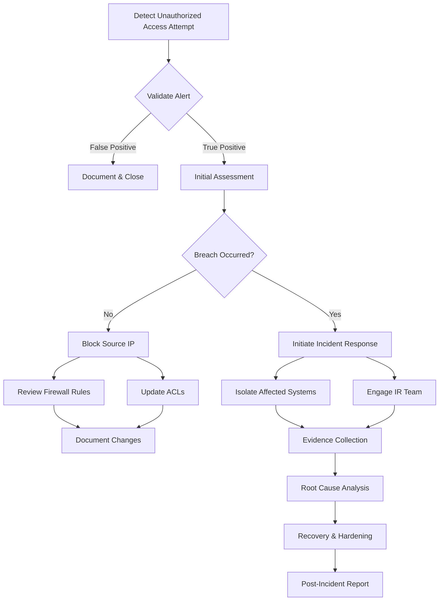

# Unauthorized Firewall Access Analysis

## Threat Analysis & Framework Mapping

### MITRE ATT&CK
- Initial Access (TA0001)
- Defense Evasion (TA0005)
- Persistence (TA0003)
- Command and Control (TA0011)

### Regulatory Framework Compliance
1. ISO 27001
   - A.9.2 User Access Management
   - A.12.4 Logging and Monitoring
   - A.13.1 Network Security Management

2. NIS 2
   - Article 21: Risk Analysis and Information System Security
   - Article 23: Incident Reporting

3. DORA
   - Article 13: ICT Risk Management
   - Article 17: ICT-Related Incident Reporting

4. PCI DSS v4.0
   - Requirement 7: Access Control
   - Requirement 10: Audit Logging
   - Requirement 1: Network Security

5. SOC2
   - CC6.1: Logical Access Security
   - CC7.2: Incident Response
   - CC7.3: Anomaly Detection

## Log Sources & Monitoring

### Primary Log Sources
1. Cisco ASA
   ```
   %ASA-6-605005: Login permitted from [source_ip] to [management_interface]:ssh
   %ASA-6-113008: AAA transaction status ACCEPT
   %ASA-4-113019: Group = [group], Username = [username], IP = [source_ip], Session disconnected
   ```

2. Fortinet FortiGate
   ```
   date=2024-01-20 time=10:30:15 devname="FG100F" devid="FG100F123456" logid="0100032002" level="warning" vd="root" user="admin" ui="ssh" action="login" status="failed"
   ```

3. F5 BIG-IP
   ```
   "mcpd[pid]: 01420002:5: AUDIT - User [username] - RAW: Authorization failed for uri [/mgmt/tm/sys]"
   ```

## Detection Queries

### Microsoft Sentinel KQL Query
```kql
let timeframe = 1h;
let threshold = 5;
(
union isfuzzy=true
    (CommonSecurityLog
    | where DeviceProduct in ("Cisco ASA", "FortiGate", "F5 BIG-IP")
    | where Activity contains "login" or Activity contains "Authentication"
    | where ActionOutcome == "Failure"
    ),
    (Syslog
    | where ProcessName in ("sshd", "httpd")
    | where SyslogMessage contains "authentication failure" or SyslogMessage contains "login failed"
    )
)
| summarize
    FailedAttempts = count(),
    SourceIPs = make_set(SourceIP),
    LastFailure = max(TimeGenerated)
    by DestinationHostName, Account
| where FailedAttempts >= threshold
| extend TimeKey = bin(LastFailure, 10m)
| project
    TimeKey,
    DestinationHostName,
    Account,
    FailedAttempts,
    SourceIPs,
    LastFailure
```

### Microsoft Defender Advanced Hunting Query
```kql
let timeRange = 1h;
let failureThreshold = 5;
DeviceLogonEvents
| where Timestamp > ago(timeRange)
| where LogonType in ("RemoteInteractive", "NetworkCleartext")
| where ActionType == "LogonFailed"
| where TargetDeviceName has_any ("FW", "ASA", "FortiGate", "BIG-IP")
| summarize
    FailedAttempts = count(),
    LastFailedAttempt = max(Timestamp),
    SourceIPs = make_set(RemoteIP)
    by DeviceName, AccountName
| where FailedAttempts >= failureThreshold
| project
    DeviceName,
    AccountName,
    FailedAttempts,
    LastFailedAttempt,
    SourceIPs
```

## Incident Response Flowchart for Security Analysts



## Instructions for IT Team

### Immediate Actions
1. DO NOT restart the firewall or clear logs
2. Take immediate screenshot/copy of active sessions
3. Enable enhanced logging if not already active

### Investigation Steps
1. Access Review
   - Export current access control lists
   - Review recent configuration changes
   - Document all admin accounts and last login times

2. Network Analysis
   - Capture traffic from suspicious IP addresses
   - Review VPN and remote access logs
   - Check for unusual outbound connections

3. System Hardening
   - Implement geo-blocking if applicable
   - Review and update access control lists
   - Enable multi-factor authentication if not present
   - Update firmware/software to latest stable version

### Documentation Requirements
1. Timeline of events
2. All observed indicators of compromise
3. Configuration changes made
4. List of affected systems
5. All remediation actions taken

### Communication Protocol
1. Maintain incident ticket with all findings
2. Update security team every 2 hours
3. Coordinate with network team for changes
4. Prepare summary for management