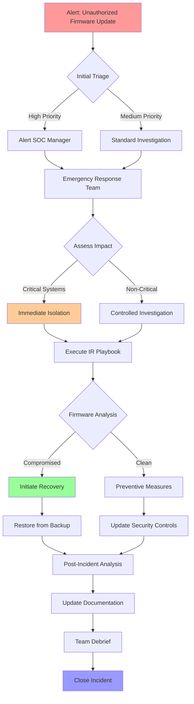

# Comprehensive Security Analysis - Unauthorized Firmware Update

## Executive Summary
This document provides a comprehensive security analysis for unauthorized firmware update scenarios, including threat analysis, detection methods, response procedures, and compliance mappings.

## 1. Threat Analysis & Framework Mapping

### MITRE ATT&CK References
- **Initial Access**: T1200 - Hardware Addition
- **Execution**: T1547 - Boot or Logon Autostart Execution
- **Defense Evasion**: T1542 - Pre-OS Boot
- **Impact**: T1495 - Firmware Corruption

### Compliance Framework Mapping

#### ISO 27001
- A.8.1.1 (Asset Management)
- A.12.5.1 (Installation of software on operational systems)
- A.14.2.2 (System change control procedures)

#### NIS 2
- Article 21: Supply chain security
- Article 18: Risk management measures

#### DORA
- ICT Risk Management requirements
- ICT Third Party Risk Management

#### PCI DSS 4.0
- Requirement 6.3: Secure software development
- Requirement 12.3: Hardware and software changes

#### SOC 2
- CC6.8: Change Management
- CC7.1: Security Operations

## 2. Log Sources & Detection

### Network Device Logs

#### 1. Cisco ASA
```
%ASA-4-405001: Firmware update attempted
%ASA-2-106001: Inbound TCP connection denied from IP_address/port to IP_address/port flags tcp_flags on interface interface_name
```

#### 2. Fortigate
```
date=2024-01-20 time=14:30:00 devname="FortiGate" devid="FG100D" logid="0100032001" type="event" subtype="system" level="error" vd="root" eventtime=1612345678 tz="+0000" logdesc="Firmware upgrade attempted" action="upgrade" status="failure" reason="unauthorized" 
```

#### 3. F5 BIG-IP
```
Jan 20 14:30:00 bigip warning tmm[32000]: 01010101:4: Unauthorized firmware update attempted from IP:PORT
```

### Detection Queries

#### Microsoft Sentinel KQL
```kusto
union isfuzzy=true
(SecurityEvent
| where EventID in ("4688", "4624", "4625")
| where CommandLine contains "firmware" or CommandLine contains "update"
| where AccountType == "System"),
(DeviceEvents
| where ActionType == "UsbDriveMounted"
| where DeviceDescription contains "firmware"),
(CommonSecurityLog
| where Activity contains "firmware" or Activity contains "update"
| where SourceIP !in (known_maintenance_ips))
| project TimeGenerated, Computer, Account, CommandLine, Activity, SourceIP
```

#### Microsoft Defender Advanced Hunting
```kusto
let known_admins = (IdentityInfo
| where JobTitle contains "systems" or JobTitle contains "admin"
| project AccountName);
DeviceEvents
| where ActionType in ("PnpDeviceConnected", "UsbDriveMounted")
| where InitiatingProcessCommandLine contains "firmware"
| where InitiatingProcessAccountName !in (known_admins)
| project Timestamp, DeviceName, AccountName, ActionType, InitiatingProcessCommandLine
```

## 3. Incident Response Flowchart and Procedures

### Initial Response Flow


## 4. IT Team Instructions

### Immediate Actions
1. ISOLATE affected systems from network immediately
   - Disconnect network cables
   - Disable wireless interfaces
   - Document current network connections before disconnection

2. DISABLE USB ports
   - Use Group Policy or endpoint management tools
   - Physical blocking if necessary
   - Document any connected USB devices

3. BLOCK source IP
   - Update firewall rules
   - Document blocked IP for investigation
   - Monitor for lateral movement attempts

4. COLLECT logs
   - System event logs
   - Network traffic logs
   - SIEM alerts
   - Physical access logs

### Investigation Procedure
1. Document Current State
   - Current firmware version
   - Last known good configuration
   - System state indicators
   - Running processes

2. Forensic Analysis
   - Memory dump analysis
   - Firmware integrity verification
   - Network traffic analysis
   - USB activity logs

### Recovery Steps
1. Firmware Restoration
   - Verify clean firmware image
   - Document hash values
   - Use secure recovery environment
   - Maintain chain of custody

2. System Hardening
   - Update access controls
   - Implement additional monitoring
   - Review and update policies
   - Conduct security assessment

### Post-Incident Tasks
1. Documentation
   - Incident timeline
   - Actions taken
   - Evidence collected
   - Lessons learned

2. Process Improvement
   - Update procedures
   - Enhance monitoring
   - Additional controls implementation
   - Team training requirements

## 5. Risk Mitigation Strategy

### Technical Controls
1. Hardware Security
   - Implement HSM for firmware signing
   - Secure boot configuration
   - TPM utilization
   - Hardware inventory management

2. Network Security
   - Network segmentation
   - Access control lists
   - Network monitoring
   - Intrusion detection/prevention

### Administrative Controls
1. Policy Updates
   - Firmware management policy
   - Change control procedures
   - Incident response plans
   - Training requirements

2. Process Improvements
   - Regular audits
   - Compliance checks
   - Vendor management
   - Documentation updates

### Physical Controls
1. Access Management
   - Secure areas for critical systems
   - Video surveillance
   - Access logs
   - Environmental controls

## 6. Monitoring and Alerts Configuration

### Alert Triggers
1. Unauthorized firmware modification attempts
2. Suspicious USB device connections
3. Unusual network traffic patterns
4. Failed authentication attempts

### Response Thresholds
1. Critical: Immediate response required (15 minutes)
2. High: Response required within 1 hour
3. Medium: Response required within 4 hours
4. Low: Response required within 24 hours

## 7. Compliance Reporting Requirements

### Documentation Requirements
1. Incident timeline
2. Actions taken
3. Evidence collected
4. System changes
5. Policy updates

### Notification Requirements
1. Internal stakeholders
2. Regulatory bodies
3. Affected customers
4. Law enforcement (if required)

## 8. Training and Awareness

### Technical Team Training
1. Firmware security best practices
2. Incident response procedures
3. Tool-specific training
4. Compliance requirements

### End-User Training
1. Security awareness
2. Incident reporting
3. Policy compliance
4. Best practices

